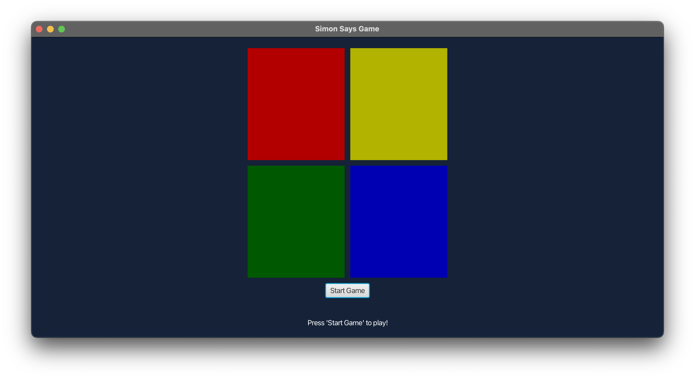

# JavaFX Simon Game



## Overview
The JavaFX Simon Game is a graphical rendition of the classic electronic game of memory skill, Simon. Developed using JavaFX, this interactive application challenges players to remember and replicate sequences of colors and sounds.

## Features
- **Graphical User Interface**: Built with JavaFX for a smooth and responsive user experience.
- **Increasing Difficulty**: As the game progresses, the sequences become longer and more complex.

## Installation

### Prerequisites
- Java 11 or later
- JavaFX SDK

### Steps
1. **Clone the Repository**
   ```
   git clone [https://github.com/i-am-nolan25/Simon-Says.git](https://github.com/i-am-nolan25/Simon-Says.git)
   cd Simon-Says
   ```

2. **Compile and Run**
    All the required SDK and modules are already installed in this repository. You can use your preferred IDE and follow this file path to run the java application.
    ```
    
    ```

## Usage
After launching the game, follow these steps:
1. Press the 'Start' button to begin the game.
2. Watch and memorize the sequence of colors.
3. Repeat the sequence by clicking on the color buttons in the same order.
4. The game continues with increasingly complex sequences until a mistake is made.
5. Enjoy the game!

## Dependencies
- JavaFX SDK

## Contributing
Contributions to the JavaFX Simon Game are welcome. If you wish to contribute, please follow these steps:
1. Fork the repository.
2. Create a new branch (`git checkout -b feature-branch`).
3. Make your changes and commit (`git commit -am 'Add some feature'`).
4. Push to the branch (`git push origin feature-branch`).
5. Create a new Pull Request.

## License 📄
This project is licensed under the [MIT License](https://github.com/i-am-nolan25/Simon-Says/blob/main/LICENSE).

## Troubleshooting 🛠️
Please create a new [issue](https://github.com/i-am-nolan25/Simon-Says/issues/new).

## Contact 📬
For any inquiries, feedback, or collaboration opportunities, please feel free to reach out to me through my [email](nl020@bucknell.edu) or [LinkedIn](https://www.linkedin.com/in/naing-oo-lwin-nolan/).
